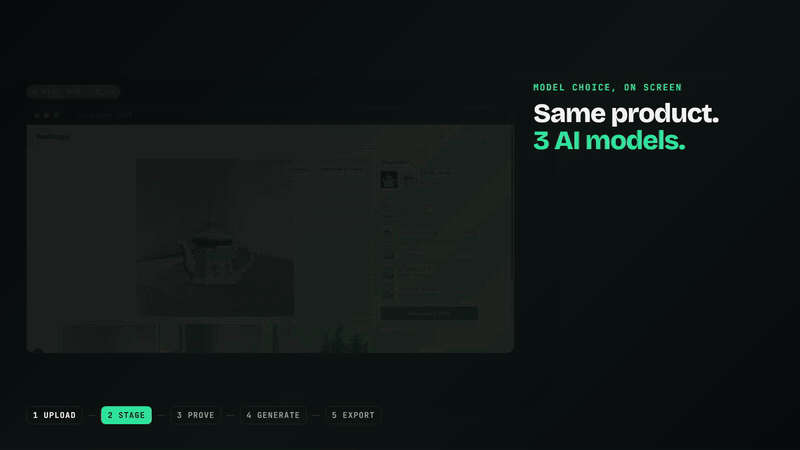

# RealStage

**Your real product. Studio stages. Every marketplace size.**

Upload one phone photo. Cloudinary cuts out your **real** product, places it on studio stages generated by **3 different AI models side by side**, can optionally relight the scene while locking your original product pixels back on top, and exports a 4-file marketplace kit: Amazon white 2000×2000, Instagram, Story and WhatsApp/Meesho.

> Built for **Pixels to Products: Cloudinary AI Hackathon 2026** (HackIndia) · **Track 2: Generative Content Workflows**
> Runs entirely on Cloudinary's **free tier**: 50 image-generation credits, $0.

- **Live demo:** `https://<your-vercel-url>` (set after deploy)
- **Demo video:** https://youtu.be/QtBXTceT8sI (2:04, made in Remotion from the real live run: [video/](video/README.md))
- **Planning and reviews:** [docs/README.md](docs/README.md)



---

## 1. Track
**Track 2: Generative Content Workflows.** It asks for "Cloudinary AI image generation, including variations and model choice, inside an existing pipeline". RealStage covers both halves:
- **Model choice:** the first thing you see is the same real product on the same scene generated by **flux-2-klein-9b**, **nano-banana-1** and **recraft-v3**, side by side, each card labelled with model and seed.
- **Variations:** "Describe a new stage" has a model picker that shows each model's **real credit price**: Flux, 3 seeded variations for 3 credits; Nano Banana, 1 image for 4; Recraft, 1 image for 4.

## 2. Problem
- India's small online sellers (Meesho resellers, Instagram and WhatsApp shops, first-time Amazon sellers) shoot products on a bedsheet or kitchen floor.
- Every channel wants a different image: Amazon a pure-white 2000×2000 main image, Instagram 4:5, Stories 9:16, WhatsApp square.
- A pro shoot costs ₹4,000–5,000 ([Business Upturn](https://www.businessupturn.com/business/zomato-urges-restaurants-to-ditch-ai-generated-food-images-to-avoid-misleading-customers/)).
- Generic AI photo tools can quietly **redraw the product**. Buyers punish that: Zomato banned AI-generated dish images in Sept 2024 after complaints, refunds and bad ratings ([Inc42](https://inc42.com/buzz/zomato-bans-use-of-ai-generated-images-by-restaurant-partners/)).

## 3. Solution
1. **Upload** a photo, or tap one of 3 samples.
2. **Cutout:** Cloudinary removes the background once (`e_background_removal/e_trim`).
3. **Pick a stage:** the real product is composited onto AI-generated stages, with a contact shadow, all as Cloudinary layers. Library stages are free to use. **Compare** shows your original pixels and the staged product side by side, at the same scale.
4. **Relight with AI** (optional, 1 credit):
   - `image_to_image` relights the scene.
   - An edge-map alignment check confirms the AI didn't move the product.
   - Your original pixels (`_core`) are layered back on top. This is **Pixel-Lock**.
   - If the AI moved the product, the app says so and keeps the exact photo.
5. **Generate new stages** from a prompt, live: pick the model, see its price, get variations.
6. **Download the kit**: 4 files, each its own download, plus "Download all" (zipped in the browser).

## 4. Tech
- **Next.js 16** (App Router) on **Vercel Hobby**
- **Cloudinary Node SDK v2**, plus the **Image Generation API** (`/v2/generate`)
- **sharp** for three small server checks: cutout coverage, Pixel-Lock core erosion, alignment and the Amazon white check
- **JSZip** for the client-side "Download all"
- **Vitest**: 64 tests. The network is blocked in tests, so no test can spend credits.
- Fonts: Bricolage Grotesque, Instrument Sans, JetBrains Mono (`next/font`, OFL)

## 5. Cloudinary integration (feature map)
Cloudinary is the **whole backend**: there is no database.

| Cloudinary capability | Where | What it does in RealStage |
|---|---|---|
| Signed Upload API (direct from browser, `overwrite:false`, incoming `c_limit`) | `lib/services/cutout.ts`, `components/api.ts` | Uploads phone photos up to 10 MB without passing through Vercel |
| Background removal `e_background_removal` + `e_trim` | `lib/urls.ts` `CUTOUT_TRANSFORM` | One canonical cutout, materialized once as `<id>_cut` |
| Upload from a derived URL | `lib/cloud.ts` `uploadFromUrl` | Materializes cutouts, composites, finals (with 423 retry) |
| **Image Generation `text_to_image`** with **model choice** + seed | `lib/services/generate.ts`, `scripts/setup.ts` | Library stages and live 3-model fan-out |
| **Image Generation `image_to_image`** with reference `[1]` | `lib/services/generate.ts` | Relight of the composite |
| Async generation + tasks endpoint, quota in `limits.addons_quota` | `lib/cloud.ts` `parseGen` | Polling, plus a credit trip-wire from Cloudinary's own counter |
| Upload preset as generation target | `scripts/setup.ts` (`realstage_gen`) | Generated assets land in the right folder with tags |
| Layers/overlays `l_…/fl_layer_apply`, `o_`, `c_scale` | `lib/urls.ts` `compositeTransforms` | Product + contact shadow composited on a stage, pure URL |
| Crops, `c_pad` + `b_white`, `c_limit`, `e_blur` backdrops | `lib/urls.ts` `kitFiles` | Amazon white 2000², Instagram, Story, WhatsApp |
| `fl_attachment:<name>` | `lib/urls.ts` | Named downloads, no archive needed |
| `f_auto,q_auto` | previews everywhere | Fast on-screen images (downloads use explicit JPG) |
| Tags + contextual metadata | stages, sessions, `exp-` expiry | Data layer: stage geometry, model, seed, sessions |
| **Structured metadata** | `lib/services/kit.ts`, `scripts/setup.ts` | `rs_product_name`, `rs_stage_model`, `rs_alignment`, `rs_pixel_locked` on every final |
| Admin API (`resources_by_tag`, prefix listing, `update`, `usage`) | `lib/budget.ts`, `lib/services/stages.ts` | Library listing, budget, plan-credit guard |
| Create-if-absent (`overwrite:false` → `existing`) | `lib/budget.ts` | **Atomic credit ledger with no extra database** |
| `delete_resources_by_tag` + `invalidate` | `lib/services/cleanup.ts`, daily cron | 7-day deletion promise, CDN purged |

### Architecture
```
 Browser ──(1) /api/sign──► budget check ─► signature (fixed params)
    │ (2) direct signed upload ───────────────► Cloudinary Upload API
    │ (3) /api/cutout ─► e_background_removal/e_trim ─► _cut (+ sharp: coverage, _core)
    │ (4) /api/state  ─► library stages (tags) · AI budget · samples      [snapshot fallback]
    │      composites = Cloudinary layer URLs built in lib/urls.ts (0 credits)
    │ (5) /api/generate ─► credit slots ─► /v2/generate text_to_image ×3 | image_to_image (Pixel-Lock)
    │ (6) /api/kit ─► materialize final ─► 4 fl_attachment URLs ─► white check
    └──── Download all (JSZip in the browser)            daily cron ─► delete exp- tags (+invalidate)
```

### $0 credit budget
**Measured costs** (Cloudinary `used_by_request`, 1K):

| Model | Credits per image |
|---|---|
| flux-2-klein-9b | 1 |
| nano-banana-1 | 4 |
| recraft-v3 | 4 |
| flux-2-klein-9b-edit (relight) | 3 |

**Where the 50 free credits went or are reserved:**

| Use | Credits |
|---|---|
| 8 library stages (Kota stone on 3 models + 5 Flux scenes) | 14 spent |
| Relight bake-off, 3 samples ([docs/bakeoff.md](docs/bakeoff.md)) | 9 spent |
| Demo video | 6 reserved |
| Public live AI (judges) | 15 reserved |
| Floor, never spent | 6 |

- **Atomic ledger:** each production credit is a 1-byte raw asset claimed with `overwrite:false`. Two concurrent requests can never both win a credit.
- **Trip-wire:** live AI pauses when Cloudinary reports fewer than 7 credits remaining.
- **Mock mode:** development and tests run with `GEN_MODE=mock` and spend **0 credits**.
- **Graceful pause:** when live AI pauses, library stages and the kit keep working.

## 6. Setup
Requires Node 20+ and a free Cloudinary account.

```bash
git clone https://github.com/Guten-Morgen1302/Pixels-to-Products-Cloudinary-AI-Hackathon-2026.git
cd Pixels-to-Products-Cloudinary-AI-Hackathon-2026
npm install
cp .env.example .env.local      # fill in CLOUDINARY_URL (Console → Settings → API Keys); generate the two secrets
npm run check:free              # free-tier checks, 0 AI credits
npm run setup                   # shadow asset, upload preset, metadata fields, 3 pre-cut samples (0 AI credits)
npm run setup:generate          # library stages, guarded (≤ 20 AI credits; skips anything that already exists)
npm run dev                     # http://localhost:3000  (GEN_MODE=mock → live AI is simulated, 0 credits)
```

**Production (Vercel):**
- Import the repo.
- Set the env vars from `.env.example`, with `GEN_MODE=live`, `LIVE_AI=on`, `LIVE_UPLOADS=on`, `SESSION_SECRET` and `CRON_SECRET`.
- Deploy. The daily cleanup cron is in `vercel.json`.

## 7. How to test
```bash
npm test          # 66 unit/service tests (network blocked; credit-spending calls impossible)
npm run typecheck
npm run smoke     # real-account pipeline: sample → composite → 4 kit downloads → Amazon 2000² white (0 AI credits)
npm run bakeoff   # relight calibration on 3 samples (≤ 3 AI credits, guarded)
```

Manual check (2 minutes):
1. Open the app and tap **a sample**. Three stages appear, each with its model and seed.
2. Press **Compare**: your pixels and the staged pixels match.
3. Press **Relight with AI**. You get either an "Alignment 0.9x · real pixels locked" chip, or "We kept your exact photo".
4. Type a scene, e.g. *teak shelf, morning light*, pick a model, then **Generate**.
5. **Download all** gives 4 named JPGs; the Amazon file is 2000×2000 on pure white.
6. On a phone (390 px), the **Download all** bar stays fixed at the bottom.

## Privacy
Uploaded photos and everything derived from them carry an `exp-<date+7>` tag. A daily cron deletes them and purges the CDN.

## License
MIT
